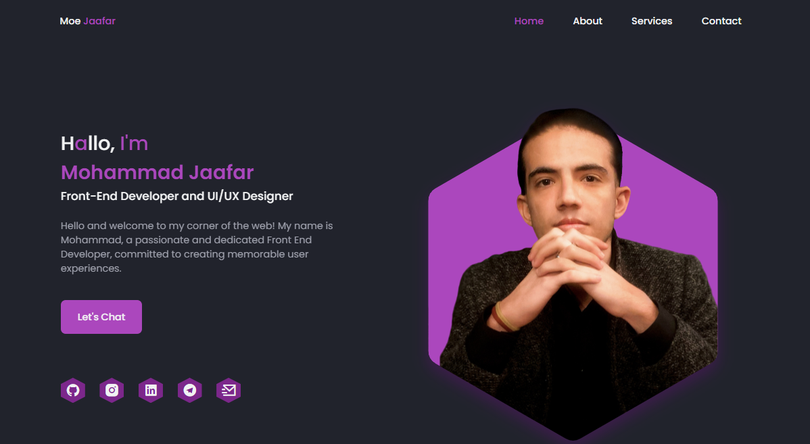

# My Responsive Portfolio Website

Welcome to the repository for my responsive portfolio website. This website is designed to showcase my projects, skills, and experiences in web development. It is created using HTML, CSS, and JavaScript and designed to be fully responsive.

 

## Features

* **Responsive Design:** The website is fully responsive and works on a range of devices, from mobile to desktop.

* **Modern UI:** The design is modern and user-friendly, providing a positive user experience.

* **Dynamic Content:** Implemented using pure JavaScript, creating interactive and dynamic content.

## Running the Website Locally

To run the website locally, follow these steps:

1. Clone the repository: `git clone https://github.com/MoeJaafar/my-responsive-portfolio-website-moe.git`
2. Open the `index.html` file in your web browser.

## Contact

If you want to contact me you can reach me at `Moet.Jaafar@Gmail.com`.
